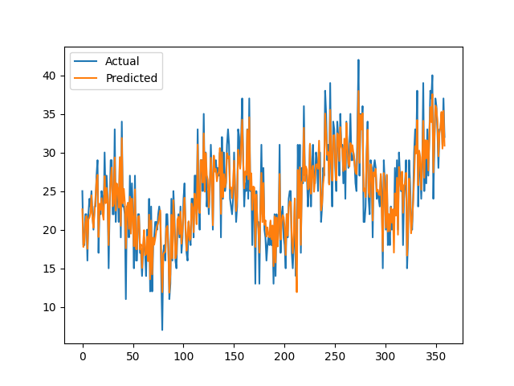
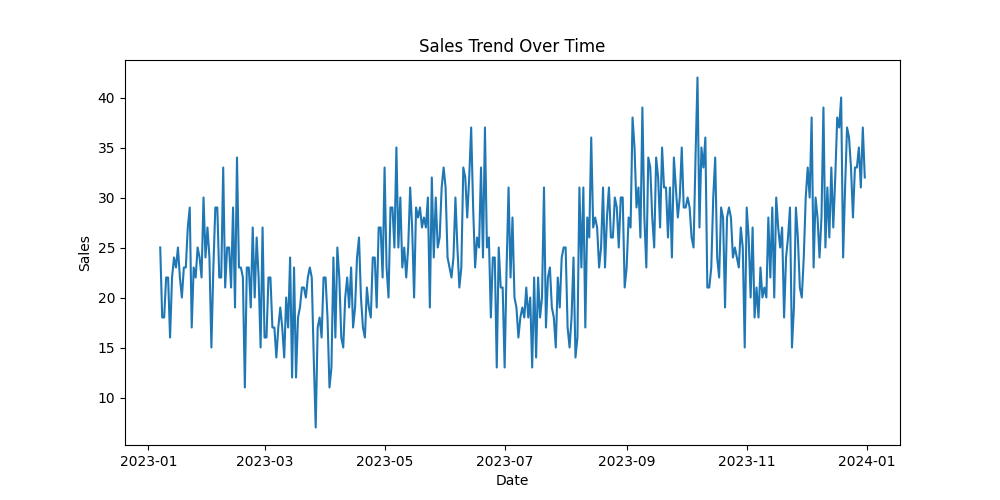
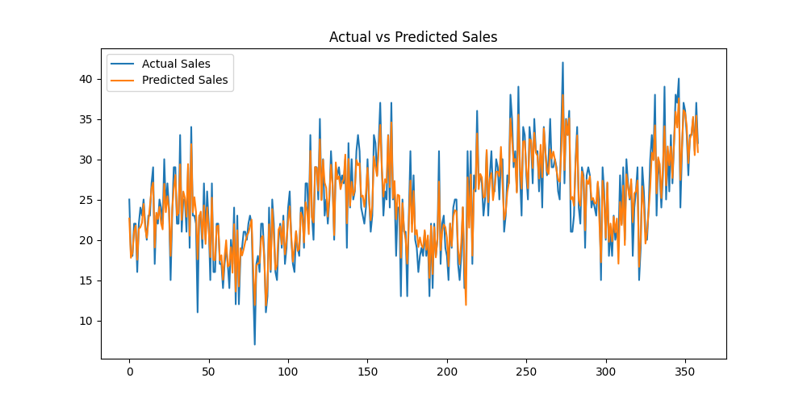

# 📊 Retail Sales Forecasting & Inventory Optimization System

## 🚀 Project Overview

This project is an end-to-end Retail Analytics solution that forecasts product-level demand and optimizes inventory decisions using Machine Learning.

It simulates how real-world retail companies manage stock efficiently to reduce stockouts and overstock situations.

---

## 🎯 Problem Statement

Retail businesses often face:

* ❌ Stockouts → Lost sales
* ❌ Overstock → Increased holding costs

This project solves these problems by:

* Predicting future sales demand 📈
* Calculating optimal inventory levels 📦
* Providing reorder recommendations ⚠️

---

## 🏢 Industry Relevance

Modern retail companies like Amazon, Flipkart, and Reliance Retail use similar systems for:

* Demand forecasting
* Supply chain optimization
* Inventory planning

---

## 💡 Business Value

* Increase revenue by reducing stockouts
* Reduce inventory holding costs
* Improve supply chain efficiency
* Data-driven decision making

---

## 🛠️ Tech Stack

* Python 🐍
* Pandas & NumPy
* Scikit-learn (Random Forest)
* Matplotlib / Streamlit
* Joblib

---

## 🏗️ Project Architecture

Data → Preprocessing → Feature Engineering → ML Model → Forecast → Inventory Optimization → Dashboard

---

## 📂 Folder Structure

Retail-Sales-Forecasting/
│
├── data/                # Dataset
├── src/                 # Core modules
├── models/              # Trained model
├── app/                 # Streamlit dashboard
├── images/              # Screenshots
├── main.py              # Main pipeline
├── requirements.txt     # Dependencies
└── README.md

---

## ⚙️ Installation

```bash
git clone https://github.com/yourusername/repo-name.git
cd Retail-Sales-Forecasting
python -m venv venv
venv\Scripts\activate
pip install -r requirements.txt
```

---

## ▶️ How to Run

### Run Main Pipeline

```bash
python main.py
```

### Run Dashboard

```bash
streamlit run app/app.py
```

---

## 🔄 Simulation Workflow

1. Generate synthetic retail dataset
2. Perform feature engineering
3. Train ML model
4. Forecast demand
5. Calculate inventory metrics
6. Display results in dashboard

---

## 📊 Results

* Accurate demand forecasting
* Inventory recommendations per product
* Reorder alerts based on stock levels

---

## 📸 Screenshots

### Dashboard


### Forecast Graph



### Inventory Output


### 📊 Sales Trend



### 📉 Forecast vs Actual


---

## 🔮 Future Improvements

* Multi-store expansion
* Real-time forecasting
* Price & promotion impact modeling
* API deployment

---

## 🎓 Learning Outcomes

* Time series forecasting
* Feature engineering
* Inventory optimization logic
* End-to-end ML pipeline
* Streamlit dashboard development

---

⭐ If you like this project, give it a star!


## 👨‍💻 Author

P.S.Chaitanya Sree
LinkedIn: https://www.linkedin.com/in/p-s-chaitanya-sree-8128bb356
GitHub: https://github.com/perumalachaitanya

---
